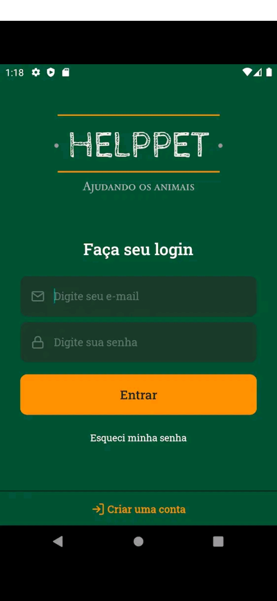
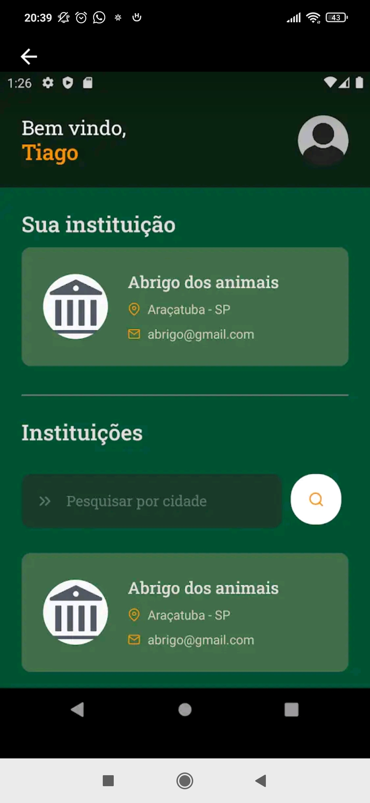
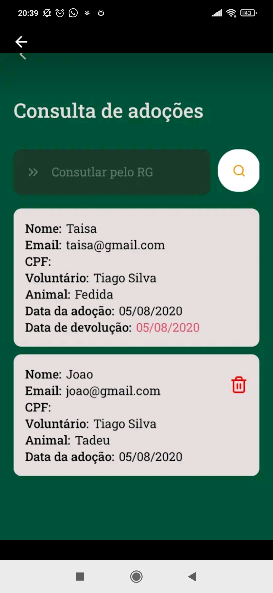
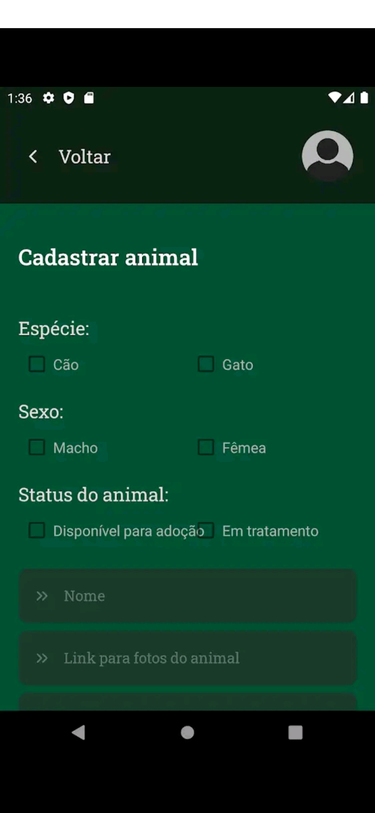
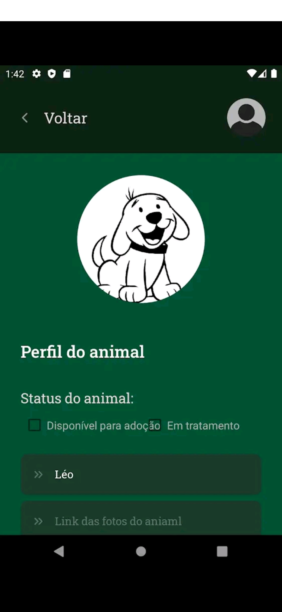

# projeto-helppet

## This is my fist personal project

Developed to help animal institutions manage adoptions

  
  

 
   

  
  

  
  

This app has been published on the Play Store, but currently the application is disabled, due to my lack of time

